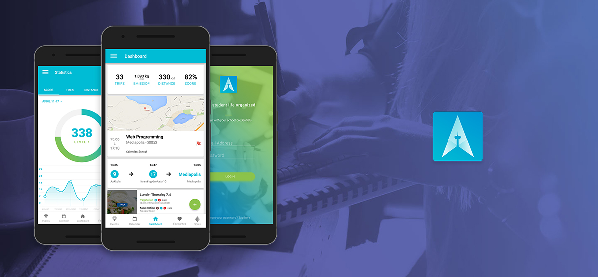
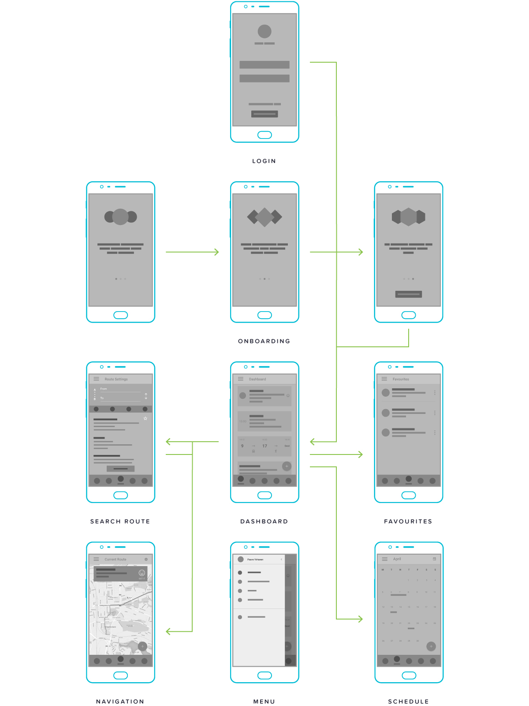
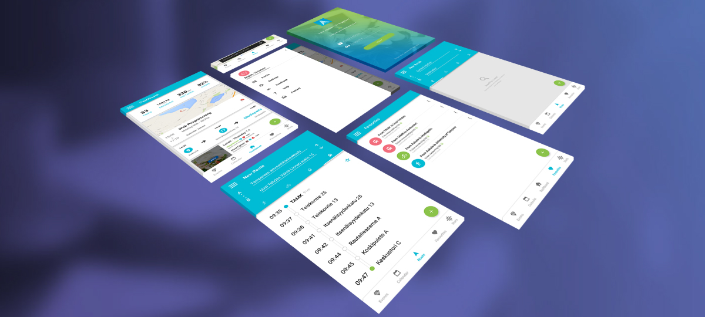
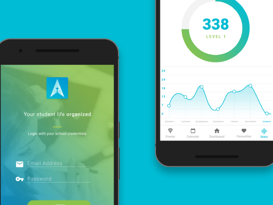
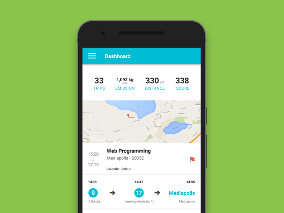
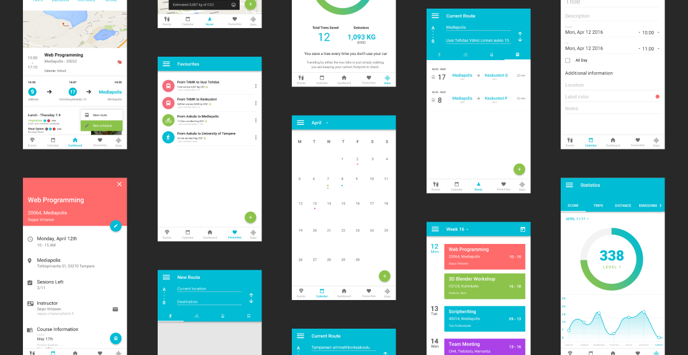

## Description

My first venture into Demola Tampere, an Android application for students that solves navigation between and on campuses. The partner in this venture is #tampere3, an initiative that is working to unify the three main universities of Tampere. In short, our task was to come up with a concept that would promote sustainable travel in addition to the navigation issue.

## Concept

Following a lengthy brainstorming period, we decided that the application should be expanded to be a student companion provided by the university. It would solve a number of immediate problems that students face in every day life. These functions include, finding classrooms, class schedule management, bus schedules, student event feed, map of points of interest, emission tracker. Admittedly, these are too numerous and in a real world situation would dilute the application's point. That being said, keeping this work conceptual we allowed ourselves no limits. For the actual mock-up and eventual implementation, we took the best parts, navigation, class scheduling and statistics.

---

## Results

As this project was primarily a way to test waters and see if there is any interest on part of the board of #tampere as well as students, we measured the feedback generated by the presentation and pitches of the idea. Technologically speaking, implementing indoor navigation is a fool's errand at this point in time. However, we did make use of the bus schedule and routes provided by an official API of the City of Tampere. Response wise, we got a lot of feedback to the tune of positivity. What students liked the most in our implementation was the possibility to view school schedules and have automatic reminders based on these. In addition to that, optimal bus routes are calculated and presented to the user in the form of a reminder.

---

<row>
  <column>
    <inner>
      
    </inner>
  </column>
  <column>
    <inner>
      
    </inner>
  </column>
</row>

