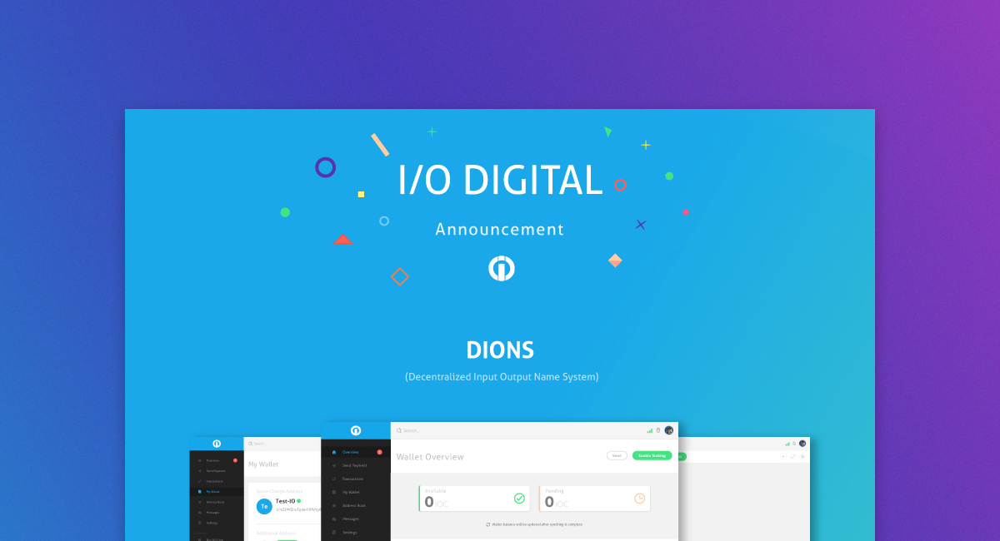

## Description

I took up the challenge to illustrate and design the layout of I/O Digital's latest announcement with regards to their roadmap and plans. The complexity of the technology had to be translated into a friendly eye catching piece that can be shared online. I relied on metaphors and abstract images to guide the reader and help make sense of each block of information. View the entire image (it's big) by clicking on the banner.

