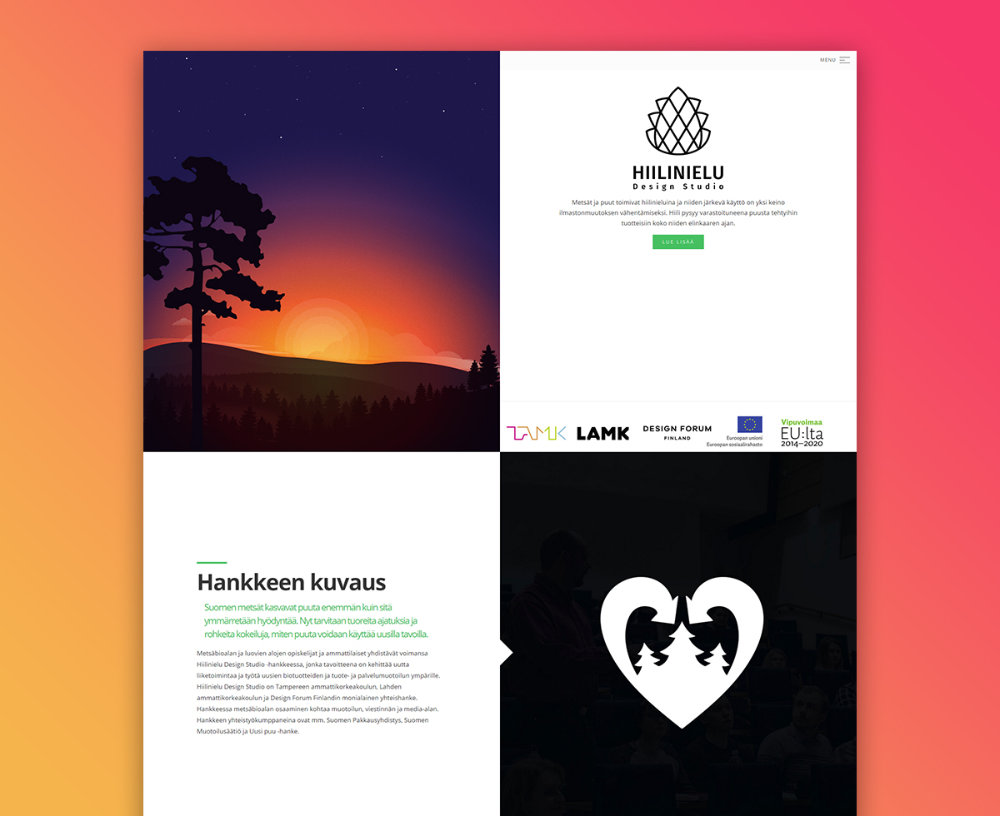
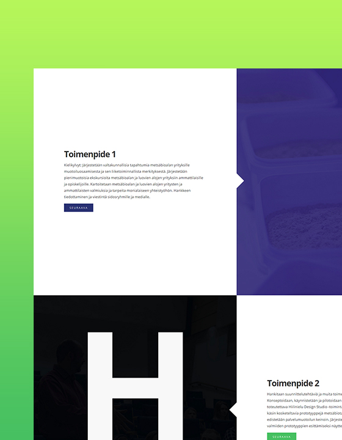
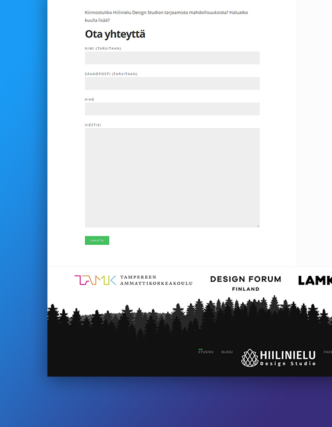
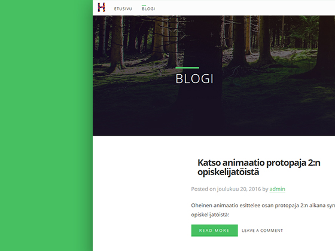
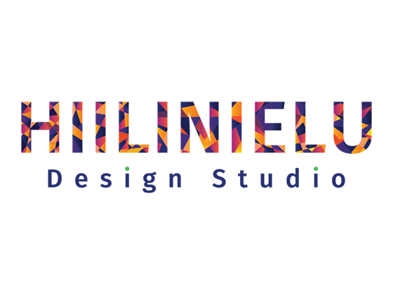
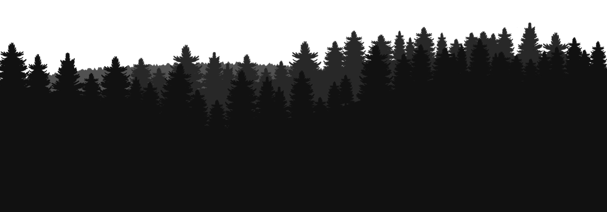

## Description

A joint project venture between a handful of public and private institutions and companies needed a website redesign and branding. TAMK, LAMK, Design Forum Finland and other forestry companies launched the project backed with EU funds to search for new uses for products made from wood. The results are hoped to spur the number of jobs in the research and manufacturing sector. It is also a very good opportunity for students of TAMK and LAMK to sink their teeth into real world problem solving and engineering.

## Challenges

Immediately, the first large hurdle to tackle was the primary task of illustrating and explaining what carbon sink means in a practical way. Of course, to engineers and people with expertise in the field it is very clear what the concepts means. For the laymen, it is a mystery. As the site is aimed for the general public, I had to think of a way to capture the meaning into an illustration and at the same time construct a website around it.

---

<row grid="2">
  <column>
    <inner>
      
    </inner>
  </column>
  <column>
    <inner>
      
    </inner>
  </column>
</row>
<row grid="2">
  <column>
      <inner>
      <h2>First Draft</h2>
      
I set about illustrating the concept of carbon sink, however, I was not satisfied with the results I was getting. I came up with a compromise that grabs the attention of the user while retaining a thematic sense to the overall picture. This draft was rejected due to the imagery of sunset. More precisely what it might mean metaphorically, an end or death. 

      </innner>
  </column>
  <column>
    <inner>
      <h2>Approved Concept</h2>
      
The logical answer was to reverse the approach, emphasize the sunrise. This challenge forced me to iterate and improve. The difference is night and day between the first draft and the final result. Ultimately, a much better execution.

    </inner>
  </column>
</row>

---

## Development

I sketched out the structure and components using my pug/stylus boilerplate. Then I went ahead and developed the theme for WordPress and made heavy use of the Advanced Custom Fields plugin for creating the half screen layout on the fly from the admin panel. My humble initiative to move on with the times and use flexbox in lieu of floats was squished when browser support came into question. I had to rewrite all of the layout components so that browsers from 5 to 6 years ago would be able to render the website.

<row grid="2">
  <column>
    <inner>
      
    </inner>
  </column>
  <column>
    <inner>
      
    </inner>
  </column>
</row>
<row grid="2">
  <column>
    <inner>
      
    </inner>
  </column>
  <column>
    <inner>
      
    </inner>
  </column>
</row>

