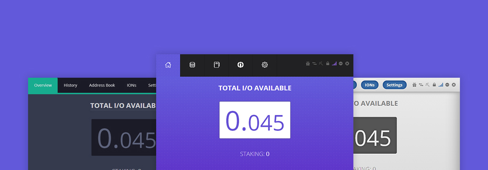
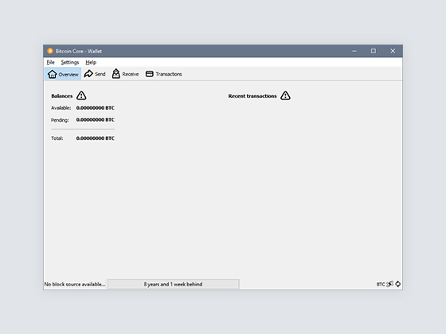
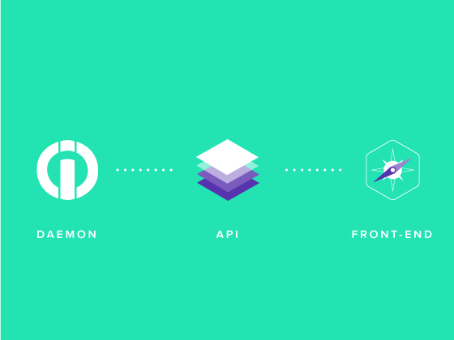
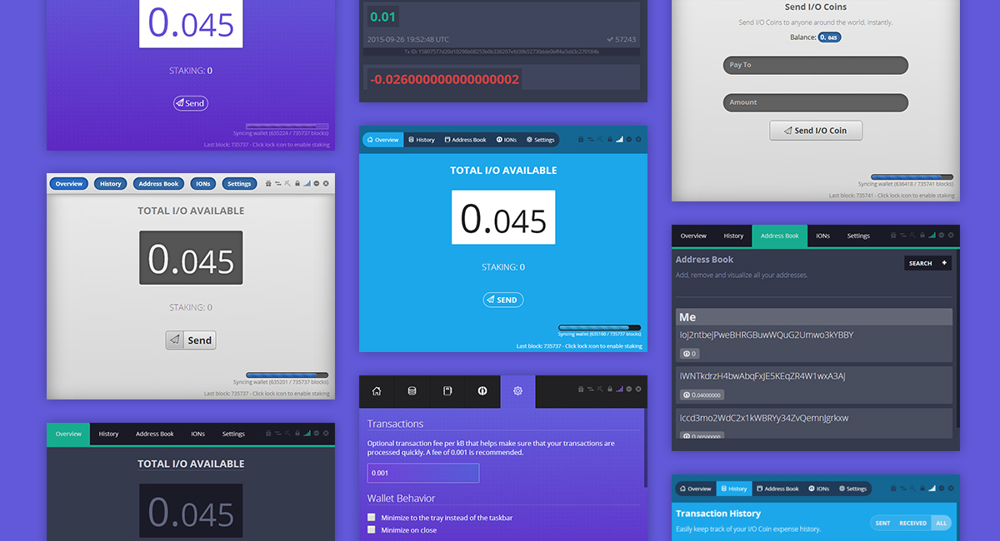

#### Description

I/O Coin is a digital currency much like Bitcoin. It is not Bitcoin, however, therefore it is known as an "alt coin". Unlike Bitcoin, it brings new features to the table by building on the solid foundation of Bitcoin and improving upon it. Features, such as aliases and many others existing and planned, try to bring cryptocurrencies into the public's eye and try to broaden the use for the blockchain technology.

#### Overview

I/O Coin is an alt-coin and thereby inherited Bitcoin's Qt Wallet GUI. This project was about setting I/O Coin apart from hundreds of other alt-coins and one of the first steps was to bring personality and brand to the fore. We made use of the latest JavaScript technologies and re-imagined the wallet from the ground up.

<row>
<column>
  <inner>
  <h4>Lift Off</h4>
  
The end result of the new wallet has to mirror the functionality that is found in the regular Qt version. This includes sending and receiving coins, address book, transaction history, settings and an I/O Coin specific feature that integrates a semi-decentralised name server. The latter of which should allow for registering or binding a string to a 34 character I/O Coin addresses.

  </inner>
</column>
<column>
  <inner>
    
  </inner>
</column>
</row>

#### Approach

With frameworks such as React and Vue, it is counterproductive to write single page web apps in pure JavaScript. In 2014 we didn't think we needed it; in 2017 we can't do without it. Regardless, the process is straight forward, connect with the daemon's api and push the updates to the front-end. It couldn't have been any simpler and by going this route, we ensured cross-platform compatibility without any unnecessary extra fiddling. Writing desktop applications using plain HTML/CSS/JS removes a lot of traditional constraints. For instance, CSS allows for a higher level of app design to come to life.

#### Results

We went into this project with a chance to improve on the already existing solution. Apart from creating a sleeker interface, we managed to lay down the groundwork for the I/O Digital brand while upping the expectations for alt-coins as a whole. Development wise, it was a great foray into single page web apps on the desktop. Looking back, we could have made our lives easier by making use of frameworks, task runners and CSS preprocessors.

