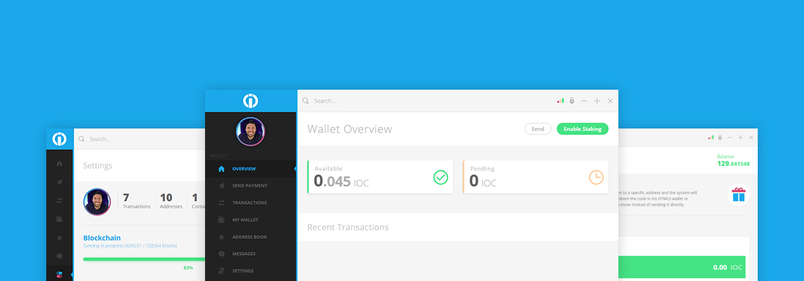
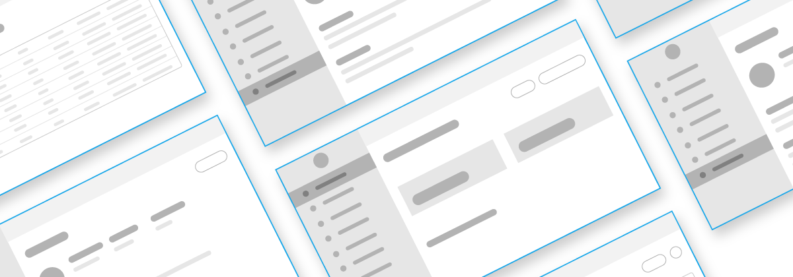
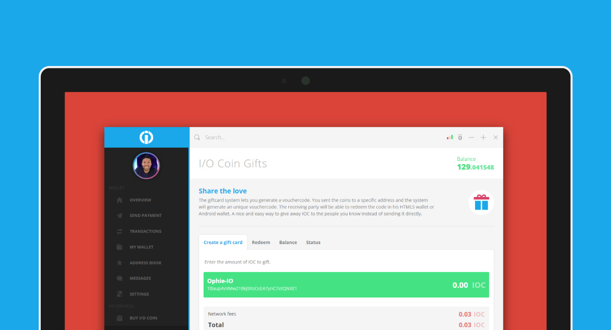
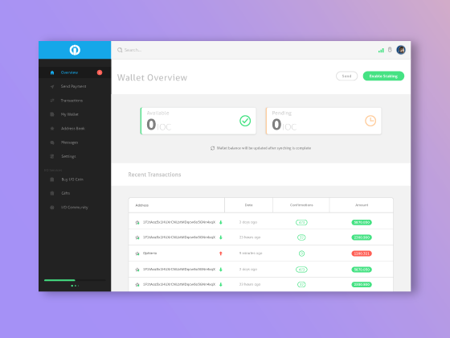
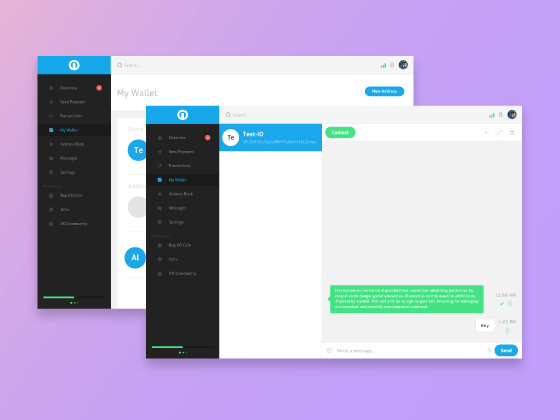

## Description

The first iteration of the wallet was the testing ground and the proof of the concept. The second version builds on what worked in the previous one and it is growing into a mature product. As I/O Coin is developing its blockchain technology with a slew of new features, pace has to be kept on the wallet front. I learned a tremendous amount while working on the previous wallet, this clean slate offers the opportunity to expand my creativity and curiosity to experiment with the UI and UX.

## Overview

With lessons learned while developing the first wallet, I set off to sketch out a full picture of the new iteration before comitting the first line of code. I kept in mind a few guiding thoughts throughout the concept phase which my designs followed in order to deliver on the high expectations. Make it modular and plan everything.

<row>
  <column padding="1.2em">
    

      
    

    <h4>Feedback Research</h4>
    
I researched the community feedback given to the previous iteration, as well as what other projects were building. The redesign has to be be a modern answer to the competition while implementing new innovative features.

  </column>
  <column padding="1.2em">
    

      
    

    <h4>Wireframing</h4>
    
Challenging yet fun, wireframing can feel like a drag at times, however, an indispensable step. It ensures that the project doesn't stall during development and sets up specific and well defined goals

  </column>
</row>
<row>
  <column padding="1.2em">
    

      
    

    <h4>Development</h4>
    
The first wallet relied on pure JavaScript that even in 2014 seemed like a dirty idea. To the surprise of no one, the code quickly became sprawling and unmaintainable. For one page web apps, reinventing the wheel is wasting time. In the spirit of upping our game we switched to a React-like framework called Mithril.js. On the CSS side, we went with Stylus for better code management. Finally, we ditched Node-Webkit in favour of GitHub's Electron.

  </column>
  <column padding="1.2em">
    

      
    

    <h4>Results</h4>
    
A clear step up in terms of work quality. The structured approach we employed during each development cycle kept the eventual goal in view. That said, work continues to deliver on the promises made to the community with regards to the implementation of all the promised features and more.

  </column>
</row>

---

## At Present

This is still a project in progress. A lot has been changed, rewritten and scrapped since I started the initial design drafts. And a lot will change until the first version is released. Furthermore, it is not feature complete and is in early beta stage. At the moment, it is being tested internally and eventually will be released for the community to give feedback and to test it further.

<row>
  <column>
    <inner>
      
    </inner>
  </column>
  <column>
    <inner>
      
    </inner>
  </column>
</row>
