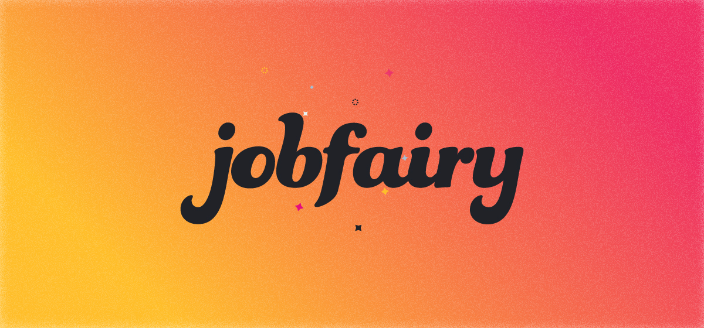
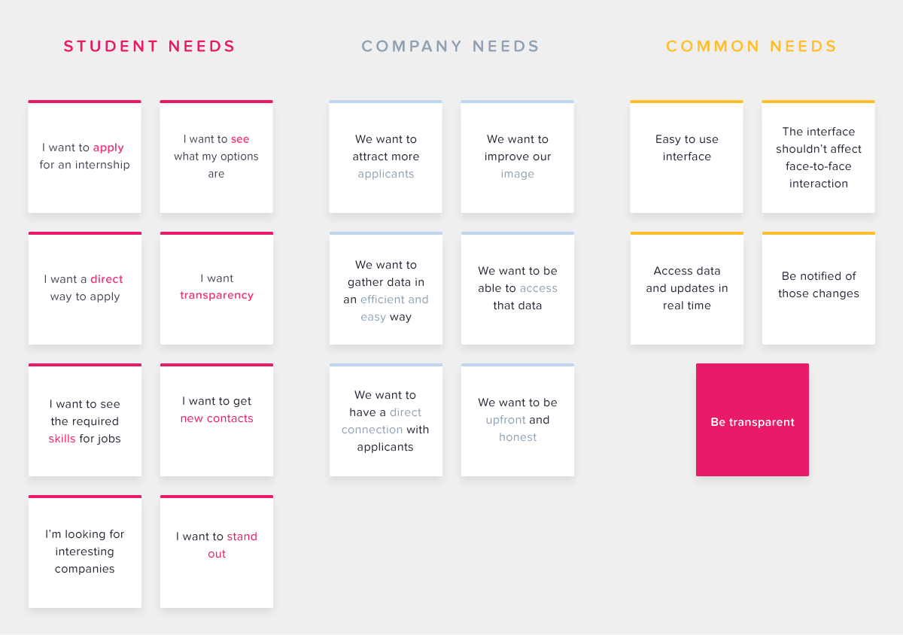
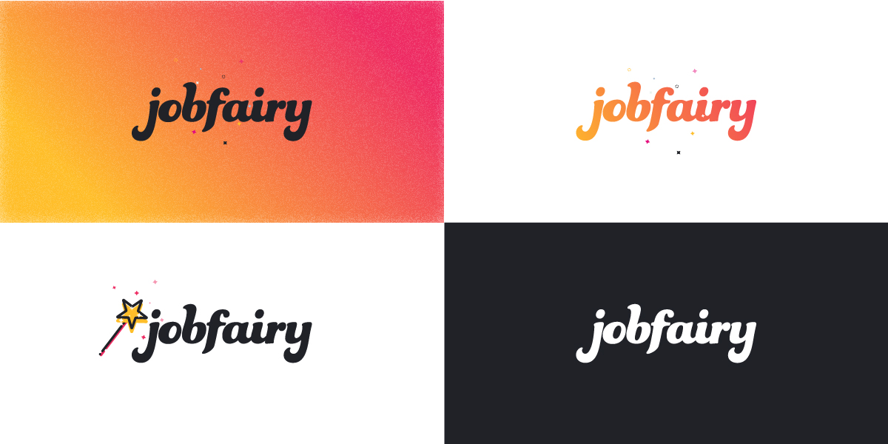
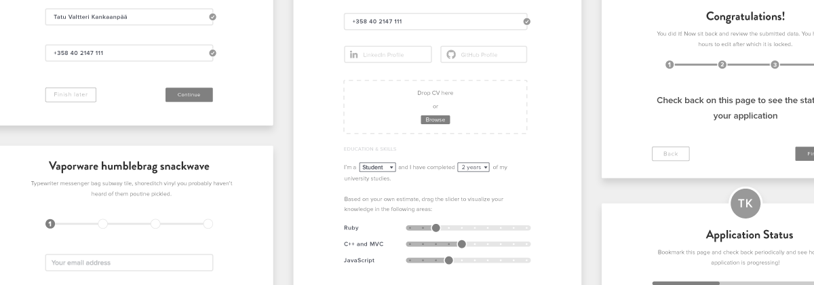
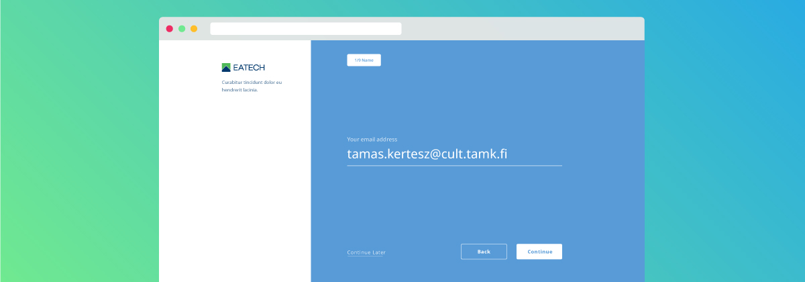
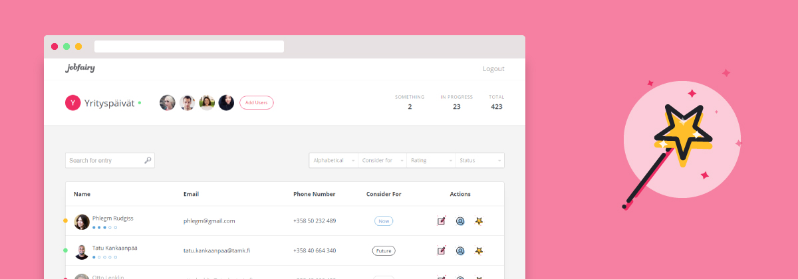
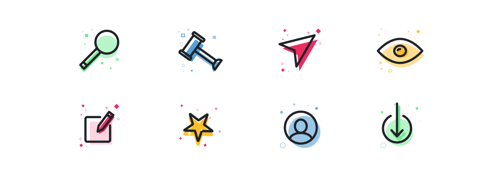

## Description

Recruitment events for students are a window into the job market, from which they get a glimpse of post-university opportunities. This means reaching out and chatting with company representatives and potentially getting a contact, business card or at the very least, candy. However, the vast majority of hazy eyed students end up with nothing much but a limp handshake and a vacant smile. Job fairs are a bust and landing a job is a pipe dream because recruitment events are not effective.

---

## Users & Needs

This solution primarily targets university students who are more or less looking for their first job, internship or summer employment. This data comes from sitting down with both groups and talking about recruitment events and what they consider are the positives, negatives and what can be improved in the overall experience.

A comparison of the two user groups that the solution is targeting. Here are their wants and in the third column, we can see their overlapping needs.

---

## User Research

We also learn key information that validates our hypothesis, that recruitment events are old fashioned and it is difficult to stand out as an individual in a sea of individuals. The primary frustration on the part of the applicants seems to be the lack of transparency with regards to the process that HR departments have when they are processing CVs. Students are left in the dark for weeks and sometimes months a time which prevents them from being able to make employment decisions on their own terms.

## Interviews

The data from the image above we gathered from going out and talking with the users. Barring that, we went to an IT recruitment fair at the local university of technology and as any good researchers, we took notes. Our findings echoed the experience of the users we interviewed. Dozens of companies ranging from SaaS software companies to engineering companies had stands set up neatly with candies, pens, brochures, business cards and most importantly, smiling company reps.

## Observations

Modus operandi went as follows, meet and greet followed by questions about open positions and inquiries based on those positions. The answers were surprisingly sparse information wise. Most company reps had no idea about the positions they were looking to fill with the exception of Software Engineers. The vague answers proved disheartening that no amount of candies could rectify. Finally, expressing my wish to apply they either invited us to have a look on their website or handed a business card with the instruction to send all applications to the email address written. One stand had a Google Form option where students could fill out their info. The results were conclusive with our previous findings.

---

## Proposal

By introducing the possibility for students to apply on the spot, we can expedite the point of a recruitment fair. The result is that students do not have to remember to do it later and can leave more satisfied and fulfilled that their time was well spent. Furthermore, the transparency question can be satisfied with a page that updates itself with relevant information just as soon as it happens. Whenever HR views, writes notes, or makes decisions, the applicant received these notifications. This paves the path for students to be more interconnected with their potential workplace, as well as to feel secure in the knowledge that their applications were not discarded, forgotten or misplaced.

---

## Prototype

The next logical step is to prototype various designs that match the specifications laid out above. The context in which this web app would be used is as follows: in a window of 2 to 3 minutes, the user can fill out a form with essential information on a tablet or computer provided at the company stand. It has to be short enough that it can be done as fast as possible but comprehensive enough that the information it collects can be used by HR during the hiring process. An invision prototype can be tested based on this concept and mock-ups.

Through this interface, users can sign up easily and within minutes.

## More Research

The concept seemed to hold water when demoed with potential users and 8 out of 10 confirmed that an application such as this would address most of their pain points at recruitment fairs. Chiefly among them, the lack of a clear second step after the events end.

---

## Results

The data seemed loud and clear when reviewed, the concept outlined so far has merit and can be applied to a real world situation where it would provide value for the end users. Armed with this knowledge, we set forth to build a working prototype and immediately test and measure user response.

HR and company reps can comb through the data and add additional notes and observations while parsing the acquired data.

---

## Finally

This was a Demola project that lasted from September 2016 to January 2017 and throughout that time my team and I managed take an idea from concept to demo. We succeeded in validating the idea with users and pitched it to an audience. Eatech Oy has decided positively as far as licensing the concept.
